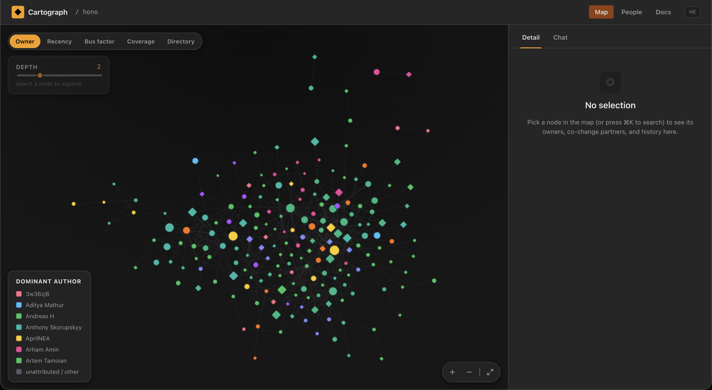
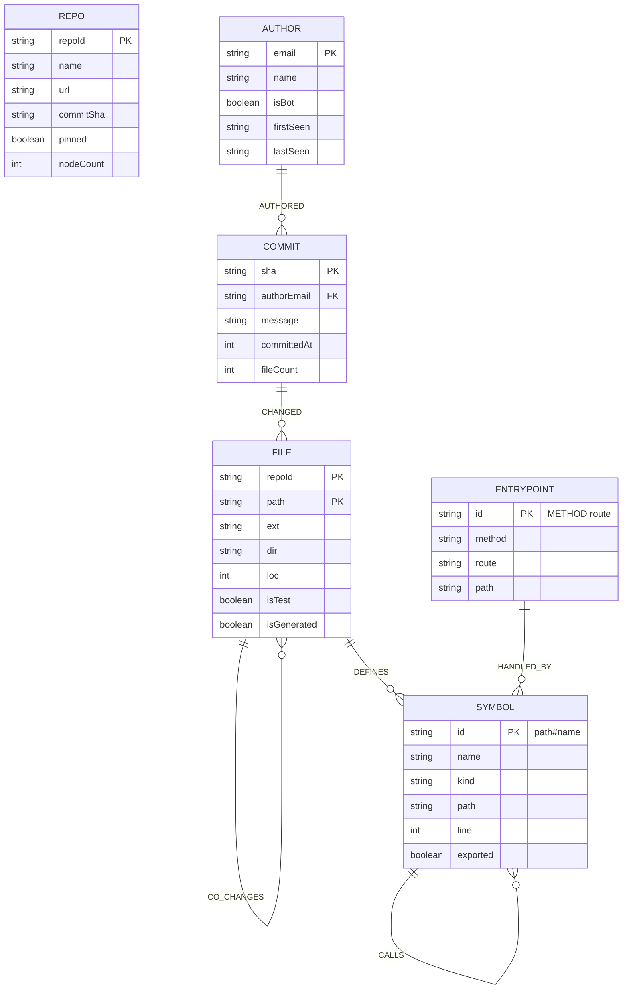

# Cartograph

**Turn any codebase into a graph; then let any AI drive over it.**

Cartograph takes a repository and its git history and loads it into a graph
database (CognoDB, openCypher/Bolt): the **files**, the **symbols** they define
and call, the **commits** that touched them, and the **authors** behind those
commits, plus the hidden relationships between them (who changed what together,
who depends on whom). It exposes the map as a fixed set of query *tools*, and the
product ships three front doors onto that registry: an interactive **web map**, a
**chat** interface with cited answers, and an **MCP server** so any agent can call
the same tools.

The product builds the map and the roads; the AI does the driving.

## Use case

A codebase is a web of relationships, not a flat list of files. Cartograph makes
those relationships visible and queryable:

- **Understand any repo fast** - see structure, ownership, and hidden coupling at
  a glance, without reading the code.
- **De-risk changes** - find the files that move together, the single point of
  failure, and what would break if you edit here.
- **Ask an AI about the code** - chat answers with citations, or plug the graph
  into your assistant over MCP so it works from the same facts you see.

## Why a graph database?

A relational database asks you to decide in advance which joins matter. A codebase
doesn't cooperate: the interesting questions are *traversals*: "which files move
together in history but have no structural link?", "what's the call path between
these two symbols?", "who is the single point of failure in this module?"

The headline query is `hidden_coupling`: co-change pairs with **no import path
within 4 hops**. Files that change together in commits but are invisible to
`JOIN`s and `FOREIGN KEY`s:

```cypher
MATCH (a:File {repoId: $repoId})-[cc:CO_CHANGES]->(b:File {repoId: $repoId})
WHERE cc.count >= $minCount AND NOT (a)-[:IMPORTS*1..4]-(b)
RETURN a.path AS a, b.path AS b, cc.count AS count, cc.strength AS strength
ORDER BY cc.strength DESC
LIMIT $limit
```

That's a multi-hop reachability test over an undirected relationship, awkward to
express in SQL, one line in Cypher. Every query is parameterised through the
official `neo4j-driver`; no user input ever touches a query string.

## Screenshots




## Features

- **Interactive map**: a cytoscape/fcose force-directed graph of any seeded or
  ingested repo, with five colour modes, focus/depth controls, and an evidence
  side panel for every node.
- **Chat with citations**: ask questions in plain English; answers come back with
  citations that highlight the exact nodes they used on the map.
- **MCP server**: a stdio Model Context Protocol server exposing all 13 graph
  tools to Claude Code or any MCP client.
- **Live ingestion**: paste a public GitHub URL: guardrails reject hostile input
  *before* cloning, a BullMQ worker runs clone → extract → load → evict, and the
  UI streams real phase names with live counts.
- **13 query tools**: a fixed, validated registry reused by all three surfaces
  (see [The main queries](#the-main-queries)).
- **Designed states**: deliberate skeletons, empty states, and a friendly
  "database may be unreachable" path instead of stack traces.

## Data model

Six labelled node types, seven typed relationships. Every node carries a
`repoId` that partitions the graph per repository: the scope key for all
queries (there is no explicit `CONTAINS` edge; containment is the shared
`repoId` property).



### Nodes

| Label | Key | Notable properties |
|-------|-----|--------------------|
| `Repo` | `repoId` | `name`, `url`, `commitSha`, `pinned`, `ingestedAt`, `nodeCount` |
| `File` | `repoId` + `path` | `ext`, `dir`, `loc`, `isTest`, `isGenerated` |
| `Symbol` | `repoId` + `id` (`path#name`) | `name`, `kind` (`function`/`class`/`const`/`arrow`), `path`, `line`, `exported` |
| `Entrypoint` | `repoId` + `id` (`METHOD route`) | `method`, `route`, `path` |
| `Author` | `repoId` + `email` | `name`, `isBot`, `firstSeen`, `lastSeen` |
| `Commit` | `repoId` + `sha` | `message`, `authorEmail`, `committedAt` (epoch), `fileCount` |

### Relationships

| Relationship | From → To | Properties |
|--------------|-----------|------------|
| `IMPORTS` | `File` → `File` | _none_ |
| `DEFINES` | `File` → `Symbol` | _none_ |
| `CALLS` | `Symbol` → `Symbol` | `count` (aggregated call sites) |
| `HANDLED_BY` | `Entrypoint` → `Symbol` | _none_ |
| `CHANGED` | `Commit` → `File` | `added`, `deleted` |
| `AUTHORED` | `Author` → `Commit` | _none_ |
| `CO_CHANGES` | `File` ↔ `File` | `count`, `strength` (in `[0,1]`) |

The schema (five indexes) is idempotent; see `packages/graph/src/schema.ts`.

## The main queries

One registry of 13 parameterised queries powers every surface - REST, chat, and
MCP - so the AI never writes its own Cypher; it composes queries that are already
written and tested. Each `QueryDef` is a single artifact: a zod schema (single
source of truth for validation and the AI tool's JSON schema), parameterised
Cypher, and a record mapper.

| Query | What it answers | Highlight |
|-------|-----------------|-----------|
| `hidden_coupling` | Which files change together but have **no import path** within 4 hops. | Flagship - invisible to SQL. |
| `search` | Find files, symbols, and entrypoints by name or path. | Navigation. |
| `neighbors` | What calls (or is called by) a symbol, up to N hops. | Blast radius. |
| `path` | The shortest call path between two symbols. | Multi-hop traversal. |
| `who_touched` | Who actually owns a file, by time-decayed change weight. | Ownership. |
| `bus_factor` | The fewest authors whose work covers half a file - the single point of failure. | Risk. |
| `co_changed` | Files that historically change together with a given file. | Coupling. |
| `cycles` | Import cycles: files importing each other back into a loop. | Structure smell. |
| `entrypoints` | All routes/handlers and the symbol each is handled by. | Surface. |
| `file_graph` | The whole-repo file structure the map renders. | Map backend. |
| `file_metrics` | Per-file colour attributes: owner, recency, bus factor, coverage. | Colour modes. |
| `file_commits` | Recent commits that touched a file. | History. |
| `tests_for_file` | Test files that import (exercise) a given file. | Safety net. |

## Architecture

Three front doors, one registry. REST, chat, and MCP all resolve tools through
`@cartograph/graph`'s `getQuery` / `executeQuery`; nothing adds graph reasoning at
the edge.

```
apps/web        React + Vite SPA  - map, panel, people, ⌘K search, chat, ingest UI
apps/api        NestJS            - POST /api/query/:name · POST /api/chat · POST/GET /api/ingest
apps/cli        cartograph ingest - extract a local repo to CognoDB or seed/*.json
apps/mcp        stdio MCP server  - the 13 tools for Claude Code / any MCP client
packages/config zod-validated env (fails fast at import)
packages/extract repo dir + git → GraphPayload (pure, no DB)
packages/graph  neo4j-driver singleton, loader, eviction, 13 queries, db:init/db:seed
packages/ingest URL → clone → pipeline engine (prechecks, guardrails)
packages/tools  QueryDef → JSON Schema for AI tool-calling
```

## Setup & run

### 1. Create the CognoDB instance

Cartograph stores the graph in **CognoDB** (openCypher over Bolt 5.0-5.4).
Provision a free **c0** instance:

1. Sign up at the **CognoDB console** and create a new **c0 instance**.
2. Note the **Bolt URI** the console shows for it (e.g. `bolt://…`).
3. When the instance is ready, the console displays a **one-time password** -
   copy it now, it is shown only once. The username is `neo4j`.
4. Give it a minute or two; it's online when the console says so.

Requires Node 20 and pnpm 9 (via Corepack). The seeded demo needs only CognoDB;
live ingestion adds **Redis** and chat adds a **Groq API key** (see step 5).

### 2. Configure the environment

```bash
cp .env.example .env
```

Fill in the values from step 1:

```bash
COGNODB_URI=bolt://…        # your instance's Bolt URI
COGNODB_USER=neo4j
COGNODB_PASSWORD=…          # the one-time password from the console
```

`.env` is gitignored; only `.env.example` is committed.

### 3. Install, initialise, and load the demo repos

```bash
pnpm install
pnpm db:init                # ensure the 5 indexes (idempotent)
pnpm db:seed                # load the 3 pinned demo repos (hono, drizzle-orm, papermark)
```

### 4. Run

```bash
pnpm --filter @cartograph/api start:dev    # API on :3001
pnpm --filter @cartograph/web dev          # web on :5173
```

Then open http://localhost:5173, pick a repo, and explore.

### 5. Optional: full features

- **Live ingestion** (paste a GitHub URL): provision a free Redis and set `REDIS_URL`.
- **Chat**: set `GROQ_API_KEY` (and optionally `GROQ_MODEL`).
- **MCP**: no extra key needed - see [Usage](#usage).

## Usage

**Query tool via REST**: validated by zod (a bad param is a 400 with the specific
issue, never a 500):

```bash
curl -X POST http://localhost:3001/api/query/hidden_coupling \
  -H "Content-Type: application/json" \
  -d '{"repoId": "hono", "minCount": 3, "limit": 10}'
```

**Ingest a public repo** (`POST /api/ingest` → 202 with a `jobId`; poll `GET
/api/ingest/:jobId` for live phases):

```bash
curl -X POST http://localhost:3001/api/ingest \
  -H "Content-Type: application/json" \
  -d '{"url": "https://github.com/sindresorhus/is-plain-obj"}'
```

**Chat** (needs `GROQ_API_KEY` in `.env`; model defaults to `llama-3.3-70b-versatile`,
override with `GROQ_MODEL`):

```bash
curl -X POST http://localhost:3001/api/chat \
  -H "Content-Type: application/json" \
  -d '{"repoId": "papermark", "messages": [{"role": "user", "content": "Which files have the strongest hidden coupling?"}]}'
```

The chat loop composes the tested query tools rather than inventing Cypher, and it
treats the LLM as *unreliable* upstream — a hosted free-tier model rate-limits and
occasionally emits malformed tool calls, so the loop degrades instead of 500-ing:

- **Rate limits & transient 5xx** — Groq's free tier caps tokens-per-minute and
  answers `429` (with a `retry-after`); those and upstream `5xx` blips are retried
  with server-advised backoff instead of surfacing as an error.
- **Malformed tool calls** — some models emit a tool call whose arguments violate the
  tool's JSON schema, and Groq rejects the whole completion with `400 tool_use_failed`.
  At `temperature: 0` that's deterministic, so the loop re-asks at escalating
  temperature and, as a last resort, answers with tools disabled — the user gets prose,
  never a raw failure. (This is why `llama-3.3-70b-versatile` is the default: it's far
  more reliable at tool calling than `gpt-oss-120b`.)
- **Token budget** — each step re-sends the full history, so tool results are capped to
  a few rows per call (`MAX_ROWS_TO_MODEL`, default 8) to keep multi-step questions
  under the free-tier ceiling.

Model selection and these safeguards live in
[`apps/api/src/chat/groq.ts`](apps/api/src/chat/groq.ts) and
[`loop.ts`](apps/api/src/chat/loop.ts).

**CLI: extract any local checkout** (or produce a committed seed payload):

```bash
pnpm --filter @cartograph/cli dev ingest ../some/repo
pnpm --filter @cartograph/cli dev ingest ../some/repo --out seed/my-repo.json
```

**MCP server**: add to Claude Code's MCP config:

```bash
pnpm --filter @cartograph/mcp start
```

## Project structure

```
├── apps/
│   ├── api/     NestJS REST API (query · chat · ingest · health)
│   ├── cli/     cartograph ingest CLI
│   ├── mcp/     stdio MCP server over the 13 tools
│   └── web/     React + Vite SPA
├── packages/
│   ├── config/  zod-validated environment
│   ├── extract/ repo + git → GraphPayload
│   ├── graph/   driver, loader, eviction, schema, 13 queries
│   ├── ingest/  URL → clone → pipeline engine
│   └── tools/   QueryDef → JSON Schema
├── seed/        committed GraphPayload fixtures (hono, drizzle-orm, papermark)
└── docs/        per-phase build log (plan.html is the design)
```

## Testing

```bash
pnpm run typecheck
pnpm run test        # vitest: unit + e2e; DB-backed tests self-skip when unreachable
```

CI (GitHub Actions) runs typecheck + tests + a Docker build of the API on every
push.

## Status & build log

The full journey is documented per phase in [`docs/`](docs/README.md); each
doc covers what was built, why, how to run it, and how it was verified.

| Phase | What shipped | Doc |
|-------|--------------|-----|
| 1–2 | Foundation, config, extraction | [docs/phase-1.md](docs/phase-1.md) · [docs/phase-2.md](docs/phase-2.md) |
| 3 | Graph layer - loader, eviction, 9 queries, CLI, seeded repos | [docs/phase-3.md](docs/phase-3.md) |
| 4 | Web application - map, panel, people, ⌘K search, 13 queries | [docs/phase-4.md](docs/phase-4.md) |
| 5 | AI surfaces - MCP server + chat with citations | [docs/phase-5.md](docs/phase-5.md) |
| 6 | Live ingestion - guardrails, BullMQ worker, streaming UI | [docs/phase-6.md](docs/phase-6.md) |

## Assumptions & limitations

Scoped as a demo, not a production product:

- **TypeScript/JavaScript repos only**; anything else is rejected at ingest.
- **No auth or user accounts** - everyone shares the single CognoDB; multi-tenancy
  is out of scope.
- **No secondary SQL/NoSQL store** - the graph database is the only store of truth;
  Redis is just the ingestion job broker.
- **API and the ingestion worker share one Azure Container Apps replica**
  (`min = max = 1`); the worker is not independently scalable.
- **Public GitHub URLs only**, history capped at 500 commits.

## Further reading

- [`plan.html`](plan.html) - the design and locked decisions (the "grill-me"
  callout at the top takes precedence over the body text).
- [`docs/README.md`](docs/README.md) - the build log index.